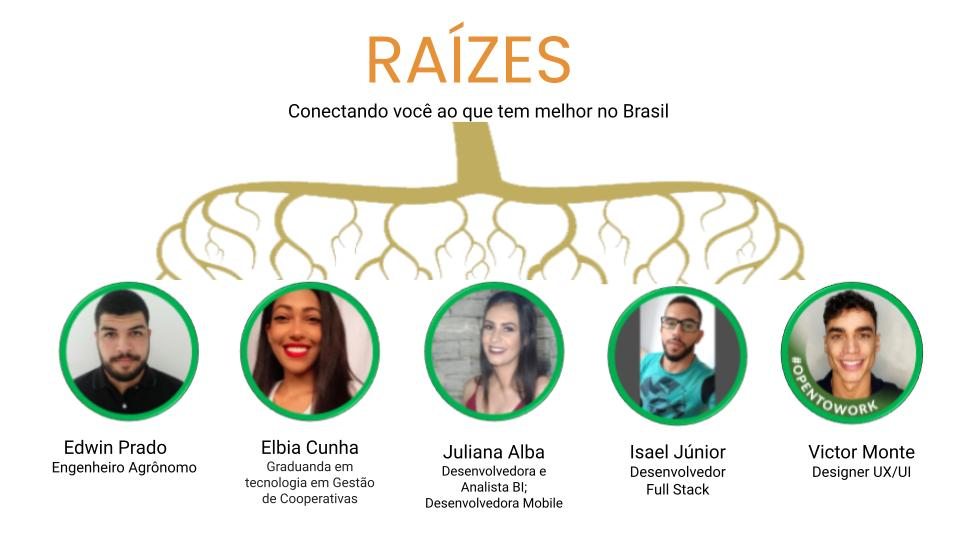
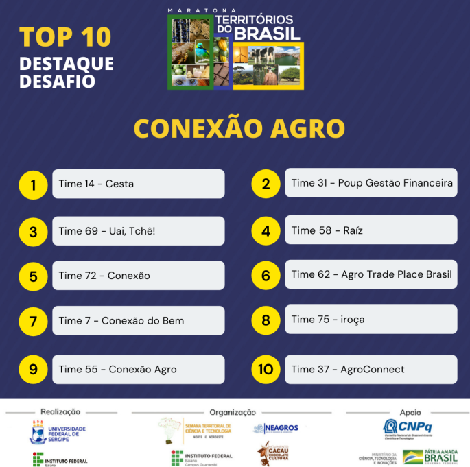

<h1 align="center"> Bem vindo(a) ao Raízes </h1>

🌱 Buscamos resolver o problema da visualização/expansão dos produtos originários da cadeia da flora nativa, o que impacta na pouca valoração e conservação da biodiversidade, impactando na pouca comercialização e retorno financeiro.

## Protótipo em desenvolvimento
<h2 align="center">   </h2>

## Fluxograma do Aplicativo Raízes
<h2 align="center">  </h2>

## Desenvolvimento
O desenvolvimento do app foi realizado com a IDE Visual Studio, com o framework *Flutter* e com a linguagem *Dart*.

## Realize o Download do Aplicativo Raízes abaixo

 

  
## Time
<h2 align="center">  </h2>

## Encerramento Hackathon Territórios do Brasil - Organização Panic Lobster 

O nosso time obteve a 4º colocação com o projeto Raízes, reconhecido em live de encerramento.

<h2 align="center">  </h2>

## Acesse a página do evento e visualize a apresentação do nosso PITCH reduzido

 

