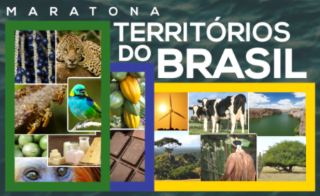

<h1 align="center"> Bem vindo(a) ao Raízes </h1>

🌱 Buscamos resolver o problema da visualização/expansão dos produtos originários da cadeia da flora nativa, o que impacta na pouca valoração e conservação da biodiversidade, impactando na pouca comercialização e retorno financeiro.

### Protótipo em desenvolvimento
<h2 align="center">   </h2>

### Fluxograma do Aplicativo Raízes
<h2 align="center">  </h2>

### 🛠 Ferramentas utilizadas 
&nbsp;
&nbsp; 

### Clicando na imagem abaixo, é possível realizar o Download do Aplicativo Raízes

  
### Time
<h2 align="center">  </h2>

### Encerramento Hackathon Territórios do Brasil - Organização Panic Lobster 

O nosso time obteve a 4º colocação com o projeto Raízes, reconhecido em live de encerramento.

<h2 align="center">  </h2>

### Clicando na imagem abaixo, é possível acessar a página do evento e visualizar a apresentação do nosso PITCH reduzido.

